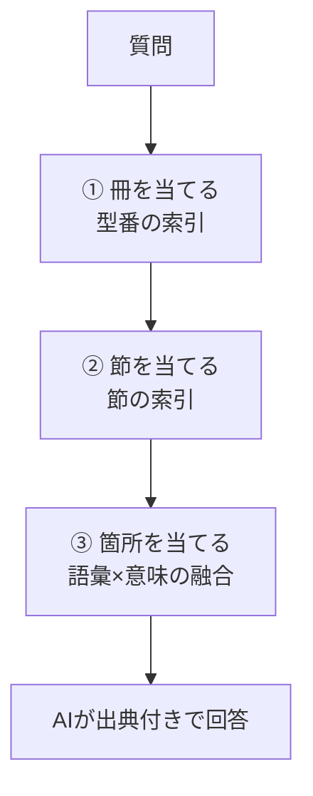

## はじめに

株式会社ピーアールアイでは、製品マニュアルを取り込むと出典付きで答えるAIナレッジ検索SaaS **「マニュアルさん」** を開発しています。

https://zenn.dev/pri_system_dev/articles/manualsan-product-launch

実際に以下のURLで稼働しています。

https://manualsan.com

マニュアルさんのような仕組みは **RAG**（Retrieval-Augmented Generation）と呼ばれます。まず質問に関係する箇所を文書から探し（Retrieval）、見つけた箇所をAIに渡して回答をまとめさせる（Generation）方式です。

RAG は資料が長い場合、その検索精度が落ちる場合が多いです。AIがどれだけ優秀でも、**最初の「探す」段で答えの箇所を見つけられなければ、正しい回答は作れません**。実際、一般的なRAGで用いられるベクトル検索だけでは、長いマニュアルで答えの箇所を拾えたのは質問の半分程度でした。

この記事では、この「探す」段を長いマニュアル向けに作り直した **Section-First RAG** と、その過程で測った結果を紹介します。

## 概要

マニュアルさんでは、人間がマニュアルを読む時の動きを参考にしてRAGの挙動を調整しています。

具体的に言うと、検索段階で **どのマニュアルか → 目次でどの章・節か → その節の中のどこか** の順に絞り込みます。Section-First RAG は、この順番を検索で再現します。

従来のRAGでもそうですが、LLMがマニュアルの本文を読むのは最後の回答作成だけです。これは検索時間の短縮と費用の削減を狙ってのことになります。

## 一般的なRAGの弱み

一般的なRAGは、文書を数百文字ずつの断片（チャンク）に分け、質問と意味が近い断片を上位から数件取り出します。最も一般的なこの方式は、長いマニュアルで次の3つを見落としやすくなります。

1. **候補が多すぎる**：1,000を超える断片があるマニュアルでは、「意味がなんとなく近い断片」が大量にあり、答えの断片が上位から押し出されます
2. **似た機種の別マニュアルに引っ張られる**：同じメーカーの似た製品では、文章が似ていることが多く、質問した機種とは別のマニュアルの断片が上位に来ます
3. **記号やコードに弱い**：エラーコードや設定番号は、ベクトル検索では探すのが苦手です

## Section-First RAG の仕組み

### ① 型番の索引でマニュアルを当てる

質問に型番や製品名が含まれていれば、取り込み時に作った型番の索引から、その製品のマニュアルを特定します。利用者が画面でマニュアルを選んでいれば、それを使います。

マニュアルさんでは検索時に対象のマニュアルをこちらで明示しなくても、質問の内容から自動でどの製品に対する質問なのか特定する機能がありますが、これがその機能の核となっています。

型番の索引の効果は大きく、短いマニュアル50問の検索では、答えの箇所が上位5件に入る割合が **索引なし 68.1% → 索引あり 90.0%** でした。

### ② 取り込み時に作る「節の索引」で節を当てる

ここが一般的なRAGとの一番の違いです。マニュアルを取り込むとき、断片とは別に **節ごとの索引** を作っておきます。節の索引の文は、次の3つを組み合わせたものです。

- マニュアル名と見出しの階層（例：「操作マニュアル > 2. 送り状を発行する > 2-1-5. 誤って作成したデータを削除する」）
- その節の下にある見出し
- 節の冒頭の本文

検索のときは、①で当てたマニュアルの節をすべて採点し、上位の節に含まれる断片を候補の先頭に置きます。断片単位で探すと埋もれてしまう答えも、節の見出しが質問に合っていれば拾えます。

なお、どのマニュアルの話か当てられない質問では、節の段を使わず、次の③だけで探します。

### ③ 語彙と意味の順位を融合する

最後に、断片の並び順を2つの評価指標をもとに作り直します。

- **意味**：質問と断片のベクトルの近さ（pgvector）
- **語彙**：質問と断片に共通する文字の組、そして型番やエラーコードなどの記号の完全一致。全角・半角などの表記ゆれはそろえてから比較

2つの順位を合体（Reciprocal Rank Fusion）し、②の節の断片と合わせて、上位N件をAIに渡します。

### LLMの利用箇所

検索の段でAIを使う箇所は、質問から関連する言葉を増やす処理（キーワード展開）だけです。質問文そのものは書き換えず、関連する言葉を足して探します。これは質問文しか読まず、マニュアルの本文は読みません。

また、AIを利用してあらかじめ節を絞り込む方式も試しました。複数の節にまたがる複雑な質問では、答えの箇所を特定できた割合が 70% → 78% に上がりました。ただし質問のたびにAIが本文を読むと、費用も待ち時間も文書の量に比例して増えるため、採用していません。

### 先行研究との関係

「文書 → 節 → 根拠の箇所」の順に絞り込む考え方そのものは、階層型RAG（Hierarchical RAG）として研究されています。たとえば HC-RAG は、財務書類を文書・節・根拠の3段で探します。また、目次をAIに読ませて読む節を選ばせる方式（PageIndex など）もあります。

Section-First RAG は、この考え方を製品マニュアル向けに組み立てたものです。違いは次の3点です。

- 1段目を **型番の索引** で当てる
- 検索の段階で **AIに本文を読ませない**
- エラーコードなどの **記号を文字の一致で拾う**

## 実測

### 測り方

- **文書**：市販のプリンター2機種と複合機1機種の取扱説明書、宅配便の出荷システムの操作マニュアル（約1,000断片）の計4冊
- **質問**：調整用42問と、調整には使わない検証用27問に分けました。型番つき・型番なし・記号・比較・複数箇所・答えがない質問を含みます
- **正解**：答えが書かれた断片をすべて列挙しました。同じ内容が複数の箇所に書かれていれば1つの正解として数えます。正解の付け方は、作問とは別のAIエージェントに点検させ、誤りを直しました
- **指標**：答えの箇所が上位に入った割合
- **経路**：本番の画面と同じコード

### 結果

| 方式 | 調整用 42問 | 検証用 27問 | 検索の段の所要時間（中央値・ノートPC） |
|---|---|---|---|
| ベクトル検索のみ | 54.8% | 55.6% | 1.3秒 |
| 以前の方式（MCTS） | 66.3% | 64.8% | 7〜11秒 |
| **Section-First RAG** | **72〜79%**（3回） | **75.9%** | **1.5秒** |
| Section-First RAG ＋ 並べ替えモデル | 90.1% | 77.8% | 12〜15秒 |

- **型番つきの質問**では、どちらの質問セットでも 95% でした（ベクトル検索のみは 53〜65%）
- ステージング環境の実機でも、検索の段は 1〜4秒で終わっています
- 並べ替えモデル（Cross-Encoder）を加えるとさらに上がります。ただ、ステージング環境のサーバー（2CPU）では、1問の並べ替えに60〜80秒かかりました。軽くする工夫を終えるまでは使わないことにしています

## 測ってわかったこと

### MCTS は、単純な方式に一度も勝てなかった

以前の精密モードは、MCTS（モンテカルロ木探索。候補の組み合わせを何度も試しながら、よい答えを探す手法）で候補を選んでいました。

ところが、実装を読み直すと、MCTS の木は章や節をたどっておらず、候補の本文を順につないだものでした。そこで、目次の木をたどる MCTS、候補の組み合わせを探す MCTS なども試作しましたが、**節をすべて採点する単純な方式に一度も勝てませんでした**。所要時間も、検索の段で一番重い処理でした。

MCTS は「探す範囲が広すぎて、全部は調べられない」ときに力を発揮する手法です。ベクトルの索引で候補がすでに絞られている今の構成では、その役目が残っていませんでした。

### 見出しの判定も、MCTS より規則のほうが正確だった

PDF から見出しの階層を取り出す処理でも、MCTS を試しました。こちらも、目次のページを除く・各ページに出る見出しの重複を除く・番号の書式から階層を決める、という規則のほうが正確でした（出荷システムのマニュアルで、親の見出しの正解率が 16% → 100%）。なお、この規則はまだ本番には入れていません。

### 同じ内容の断片を後ろへ回しても、効かなかった

後で紹介する苦手な質問への対策として、ほぼ同じ内容の断片を後ろへ回す処理も試しました。全体では 75.0% → 75.5% で、誤差の範囲でした。原因は別の段（語彙と意味の融合）にあったためです。

## 得意なこと・苦手なこと

### 得意なこと

- 型番の多い製品マニュアル、数百ページの手順書
- 言い換えた質問（例：「ドライバーが来る前に渡す書類はもう刷ってしまった」→ マニュアル上の正式名「荷物受渡書」の節にたどり着けた）

### 苦手なこと

**答えが複数の箇所に分かれる質問** は、Section-First RAG でも 33〜50% にとどまります。実際に難しい質問を作って試すと、次のような失敗がありました。

- **同じ記号が、欄によって別の意味を持つ**：出荷システムのマニュアルでは、「008」という値が、荷物の形の欄・オプションの欄・信書便の欄で、それぞれ別の意味を持ちます。「データに 008 と入っている。何の指定？」と聞くと、1つの意味しか答えられませんでした。原因は2つあります。「008」のような数字だけの語を記号の一致として数えていなかったことと、同じ意味の表が何か所もくり返し出てきて、上位を埋めていたことです
- **3冊を比べる質問**：3機種について同じことを聞くと、よく似た文章の2冊の断片が上位を占め、3冊目の断片が枠の外に押し出されました

どちらも、語彙と意味を融合する段で直せる見込みがあります。今後の課題として取り組みます。

## 限界

- 評価に使ったのは4冊・約70問です。すべてのマニュアルで同じ差が出る保証はありません
- 質問と正解はAIで作り、別のAIエージェントで点検したものです。実際の利用者の聞き方とは違う可能性があります
- 産業機器のマニュアルでは、まだ測っていません
- 測ったのは「答えの箇所を拾えたか」までで、最後の回答文の正しさそのものではありません

## まとめ

- RAG の弱点は、長いマニュアルで答えの箇所を「探す」段にあります。ベクトル検索だけでは、拾えたのは半分ほどでした
- マニュアルさんの精密モードは、人が目次を引くように **冊 → 節 → 箇所** の順で探す Section-First RAG に切り替えました。答えの箇所を拾える割合は約55% → 約76%（検証用の質問）で、検索の段は1〜4秒で終わります
- 探す段ではAIに本文を読ませず、AIが本文を読むのは最後の回答のまとめだけにしています
- 以前の方式の MCTS は、今の構成では単純な方式に勝てなかったため、精密モードから外しました
- 複数の箇所に分かれる質問は、まだ苦手です

マニュアルさんは、フリープランから試せます。「うちのマニュアルでも答えの箇所を拾えるか」といったご相談も歓迎です。

https://manualsan.com/

### 参考

- [HC-RAG: Evidence-Centric Retrieval-Augmented Generation over Heterogeneous Financial Filings](https://arxiv.org/pdf/2608.12335)
- [Zero-Shot Document Understanding using Pseudo Table of Contents-Guided Retrieval-Augmented Generation](https://arxiv.org/abs/2507.23217)
- [PageIndex: Next-Generation Vectorless, Reasoning-based RAG](https://pageindex.ai/blog/pageindex-intro)
